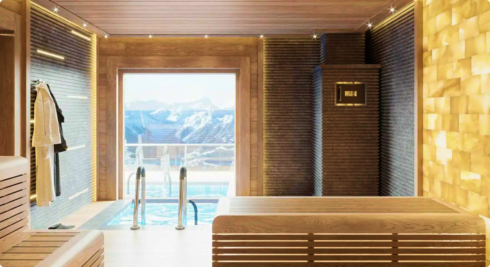

- В слайдере в html разметку вставлять слайды нужно начиная с последнего. Initial слайд, тот который отображается по умолчанию по центру экрана - второй слайд по порядку в разметке. Это сделано для того чтобы не было багов из-за того что в бесконечный loop со слайдами и не прогрузился соседний слайд.
- На слайдере 3 слайда должны быть без loading='lazy', остальные наоборот с ним - чтобы не было багов с загрузками картинок. Также нужно чтобы в слайдере было больше 4 слайдов.
- Картинки желательно переводить в webp, так они будут сильно меньше весить
- Для изображений если хотим чтобы индексировались, нужно пробрасывать alt атрибут с текстом СЕОшным
- Селекты табов работают через id у таба и data-tabid у кнопки селектора, они должны совпадать. То что было из макета в принципе уже прописано и если новых разделов добавлять не нужно то ничего менять и не придется.
- Под слайдерами с проектами есть блок с классом project-tabs-controls - это блок куда скриптом генерятся фильтры для "перемотки" слайдов на проекты. Там же указан класс spoiler - он автоматически оборачивает кнопки в спойлер (прячет под кат).

В целом, для интеграции нужно:

1. Пробросить данные в SEO-шные теги meta в шапке
2. Если есть из статического контента что-то что через админку будет прописываться, то пробросить это.
3. Интегрировать слайдер в шапке:
   3.1. Этот слайдер простой, после коммента <!-- Slides --> нужно воткнуть слайды. Слайд состоит из div с img внутри:

```
   <div class="swiper-slide">
      
    </div>
```

4. Фильтры желательно не трогать, максимум текстовый контент. Сейчас логика их работы завязана на data-tabid и id + div с классом portfolio-tab в блоках с проектами.

5. Слайдеры с проектами - самое сложное.
   5.1. Каждая большой блок с проектами (бани, сауны, хаммамы, камины) обернут в div с id='banyas' и подобными.
   5.2. В нем нужно найти swiper-wrapper и в него вставлять слайды. Начинаем с последнего слайда последнего проекта. Первые 3 слайда без loading='lazy' параметра. В первом разделе с банями представлено как должно выглядеть чтобы работало как надо.

```
  <div data-projectid="4" class="swiper-slide"> // в data-projectid пробрасываем id проекта
    <div class="swiper-slide-content">
      <h2 class="headline-2">Проект 4</h2> // название проекта
      <p class="body-text">Проект 4 слайд 4</p> // описание слайда
    </div>
      
    </div>
```

    5.3. Под слайдером располагается блок projects-actions, с ним ничего делать не нужно, ссылки на проекты генерятся скриптами, на кнопку "задать вопрос" тоже ссылка скриптом вешается в зависимости от активного слайда в слайдере.
    5.4. Подобное провернуть с остальными блоками, чтобы накидать в их слайдеры проектов.

6. Остальное в принципе тоже уже рабочее, но если нужно прокидывать из админки ссылки на соцсети или ссылку на яндекс карты, можно тоже интегрировать.
